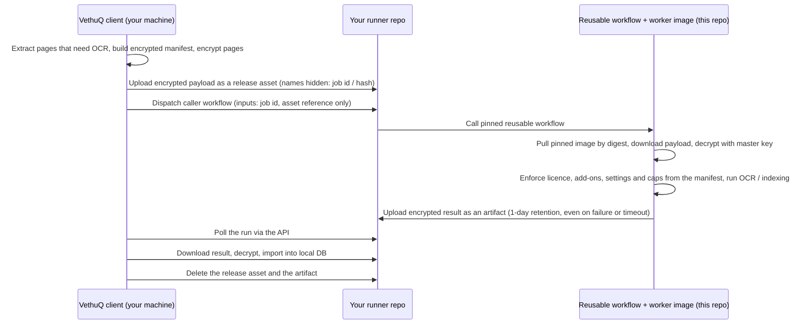

# VethuQ-github-tier

Template, reusable workflow and image build for VethuQ's self-service OCR/indexing in **your own
GitHub account**. Public; nothing secret lives here.

The VethuQ client (`vethuq github`, the `packages/vethuq-github` package in the public
[`vethuq`](https://github.com/coldsofttech/vethuq) repo) encrypts the pages that need OCR, hands
them to a repository you own, and a GitHub Actions job running the worker image from this repo
processes them. Results come back encrypted. This repo holds the pieces that make that possible.

## Why this repo is public

- A **template repository** must be readable by everyone so users can create their runner repo
  from it.
- A **reusable workflow** can only be called from other repositories if it is public.
- A public repo also gets public Actions minutes for the image build.

Because it is public, it contains only code, schemas, docs and test fixtures. See
[Never commit](#never-commit).

## What your repo contains

Your runner repo is created from this template (private by default) and holds only a **thin
caller workflow**:

- trigger: `workflow_dispatch` only (no push, pull request or schedule)
- inputs: a job id and an asset reference, nothing else
- the reusable workflow in this repo, **pinned to a tag or SHA**
- minimal `permissions`; the only secret is the master key

Template copies do not receive updates, so the pin is what moves: `vethuq github update` rewrites
it to an allowed version (see the [compatibility table](#version-compatibility)). All logic, limits,
licences and add-ons come from the encrypted manifest and are enforced inside the worker, so
editing your caller workflow changes nothing about what you are entitled to.

## Data flow

What this means in practice:

- **Everything is encrypted** (chunked AES-GCM, per-job subkeys from your master key). Public
  runner repos are usable only because of this. Sizes, timing and the repo name are still visible
  on a public repo; prefer private for caution (metadata stays private, lower free-minute cap).
- **Only the job id and asset reference are plain.** Dispatch inputs are visible in run metadata.
- **The worker makes no outbound calls** for metrics or anything else; metrics travel inside the
  encrypted result and the client sends them only if you opted in.
- **No file names or OCR text in logs or step summaries.**
- **Native-text PDF pages never leave your machine.** Only pages that need OCR are sent.
- Linux runners only.

## Layout

| Path | Purpose | Story |
|---|---|---|
| `.github/workflows/ocr.yml` | Reusable workflow (`workflow_call`): pull image by digest, fetch payload, run worker, upload result | #137 |
| `.github/workflows/build-image.yml` | Image build, smoke test and GHCR publish (guarded to run only in this repo) | #143 |
| `caller/` | Canonical thin caller workflow that the template and the client's `setup` and `update` use | #136 |
| `image/` | `Dockerfile` and build context for the single public worker image | #142 |
| `protocol/v1/` | Job protocol spec: manifest and result JSON Schemas, examples, shared fixtures | #138 |
| `docs/` | [Layout and conventions](docs/layout.md) | #135 |

Each directory has a `README.md` describing what belongs there. Files not yet built are listed
there as planned, not stubbed.

## Version compatibility

The client only dispatches to a combination listed here (and, once policy integration lands, in
the signed policy: allowed workflow tags, protocol versions and image digests).

| Workflow tag | Image (tag / digest) | Job protocol | Minimum client | Status |
|---|---|---|---|---|
| _none released yet_ | | | | |

The release process adds a row for every release (workflow tag, image tag and digest, protocol
version, minimum client). Rows are never rewritten; a withdrawn combination is marked as such.
A new add-on release needs an image rebuild and therefore a new row.

## Related repositories

| Repo | Role |
|---|---|
| [`vethuq`](https://github.com/coldsofttech/vethuq) | Client (`packages/vethuq-github`), core and add-ons |
| [`vethuq-policy`](https://github.com/coldsofttech/vethuq-policy) | Signed policy: `github_tier` flag and kill switch, compatibility table, digest allowlist |
| `vethuq-entitlements` (private) | Licensing; its wheels are published to PyPI and installed into the image |

## Never commit

This repo is public. Never commit:

- the master key or any other key, token or secret (including in test fixtures)
- real user documents, OCR text or file names; fixtures must be synthetic
- licence tokens or customer data

## Status

Repository scaffold and agreed layout (#135). The caller workflow, reusable workflow, protocol
spec and image are tracked as separate stories and land in the directories above.
